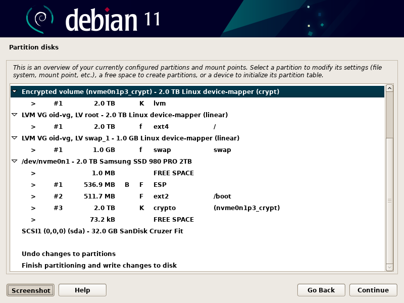
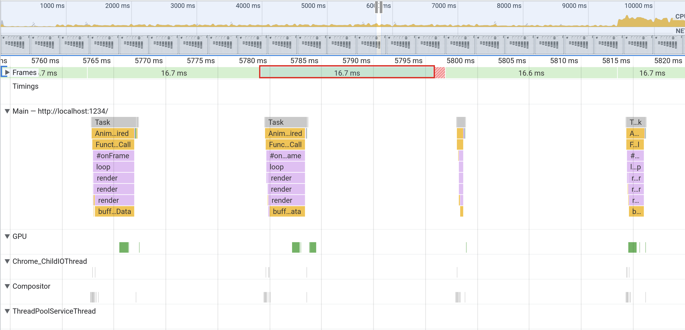
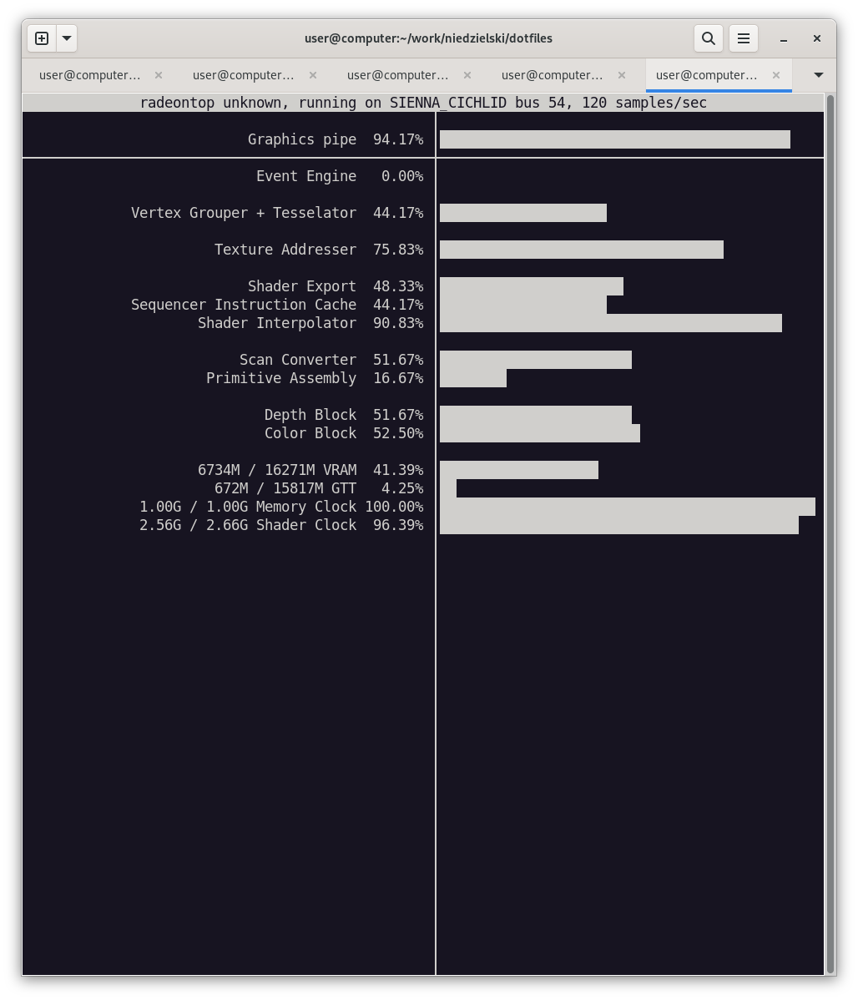

# .files

My system configuration.

## Hardware

### Laptop

Essentially, a ThinkPad X1 Yoga Gen 6 with maxed out specs, part number
20XYCTO1WW:

- 11th Generation Intel® Core™ i7-1185G7 Processor with vPro™ (3.00 GHz, up to
  4.80 GHz with Turbo Boost, 4 Cores, 8 Threads, 12 MB Cache)
- Linux Ubuntu 20.04
- Linux Ubuntu World Wide Multiple Language
- 32 GB LPDDR4x 4266MHz (Soldered)
- 256 GB PCIe SSD, OPAL
- 14.0" UHD+ (3840 x 2400) IPS, anti-reflective, anti-smudge, touchscreen, 500
  nits
- Integrated Intel® Iris® Xe Graphics
- Grey
- IR & 720p HD
- Lenovo Integrated Pen
- Intel® Wi-Fi 6 AX201 802.11AX with vPro™ (2 x 2) & Bluetooth® 5.2
- Fingerprint Reader
- Backlit - US English
- Enabled Discrete TPM2.0
- BIOS Absolute Enabled
- 4 Cell Li-Polymer 57Wh
- 65W AC
- 14.0" WQUXGA (3840x2400) IPS Anti Reflection/Anti Smudge 500nit MultiTouch
  Narrow Bezel 100% DCI-P3 HDR, IR and HD Camera, Mic
- Retail Packaging
- Publication-English
- 1 Year Depot or Carry-in

With the following service plans:

- 3Y Courier/Carry-in upgrade from 1Y Courier/Carry-in, part number 5WS0E97328
- 3Y Accidental Damage Protection Add On, part number 5PS0F15928

I wished to try a WWAN, as my carrier, Google Fi, provides data SIMs at no
additional charge, but
[PSREF lists them as unavailable in the US](https://psref.lenovo.com/Product/ThinkPad/ThinkPad_X1_Yoga_Gen_6).
I've read one cannot be retroactively added due to a missing antenna assembly.

I ordered the cheapest hard drive available and replaced it with a
"[Samsung 2TB 980 PRO PCIe 4.0 x4 M.2 Internal SSD](https://www.bhphotovideo.com/c/product/1624326-REG/samsung_mz_v8p2t0b_am_2tb_980_pro_pcie.html)"
according to this
[replacement guide](https://www.youtube.com/watch?v=j6zhenaLjho).
[I upgraded the firmware on Feb, 2023 following these notes](https://news.ycombinator.com/item?id=34649376).

The builtin webcam is poor. The keyboard is lovely.

I haven't made much use of its convertible functionality yet.

There seemed to be able to be a perpetual sale of some sort and I was also able
to use a partner discount.

I don't use the builtin display when at my desk. I usually have my two monitors connected but leave the drawing tablet off except when illustrating.

### External GPU

- [AMD Radeon RX 6900 XT Graphics processing unit](https://www.amd.com/en/direct-buy/5458372200/us)
- [Razer Core X Chroma enclosure](https://www.razer.com/gaming-egpus/razer-core-x/RC21-01430100-R3U1)
- [Noctua NF-A12x25 5V 120 mm fan](https://noctua.at/en/products/fan/nf-a12x25-5v)
- [Corsair SF750 80 Plus Platinum SFX Power Supply unit](https://www.corsair.com/us/en/Categories/Products/Power-Supply-Units/Power-Supply-Units-Advanced/SF-Series/p/CP-9020186-NA)
- [100 mm² x 1 mm thermal pad](https://www.amazon.com/dp/B086W119DK)

I used the [egpu.io buyer's guide and forum](https://egpu.io) to inform.

The GPU fans don't ever see to run at a very fast rate but when they were above
a low speed, they're noisy.

The original power supply's fan is always on. The replacement's doesn't turn on
until the load exceeds 300 W. I would replace the fan in it but I don't think
I've ever heard it turn on and I don't want to risk working near large
capacitors. The replacement supply is so much smaller than the original and is
unable to mount to anything so it rests on the thermal pad which I divided in
half and stacked to align the plug with the opening. I don't think a thermal
pad is necessary over a piece of appropriately sized metal but it's tacky which
helps keep the unit in place.

I had replaced the side fan with a 12 V
[Noctua NF-S12B redux-700](https://noctua.at/en/nf-s12b-redux-700) as I read
that the enclosure's voltage was inconsistent but 5 V or above, it's
[the quietest 120 mm fan available](https://www.quietpc.com/120mmfans), and I
figured the worst case scenario would be that the GPU fans would kick on or the
system would go into thermal shutdown. It worked and it was almost silent but I
think the system was too hot. It was almost always quite warm and, when in heavy
use, downright hot.

I replaced the fan with the quietest 5 V fan available but
it is significantly louder. The system is always quite cool now. Maybe a 140 mm
would fit. I wish the enclosure had a 12 V PWM (four pin). The GPU fans turn off
when they can.

The GPU fans blow outward so I had flipped the direction of the side fan to blow
inward but the GPU doesn't quite cover the air vent so I guessed that the
original design to have both the side fan and GPU fans blowing outwards is
probably best and have stuck with that.
[The airflow direction of the side fan is from the manufacturer's label outwards](https://noctua.at/en/how-can-i-find-out-the-direction-of-airflow-and-sense-of-rotation).
I imagine that the air could mostly flow in over the power supply where there's
a small vent but the case is really just an approximation for any card that fits
and having replaced the supply with such a different one, I suppose all bets are
off. In both directions, the fans seem to pull in a lot of particulates despite
resting high on my desk shelf.

I disabled the enclosure LEDs by disconnecting the jumper cable running between the mounted circuit board and the two LED strips. I put black electrical tape over the GPU's AMD LED logo which is always lit. I can hear the side-fan to know when it's on (it turns off when the case is powered but the GPU is unused).

### Peripherals

- [Dell UltraSharp 27 4K USB-C Monitor - U2720Q, 68.4cm (27") (210-AVJV)](https://www.dell.com/en-us/work/shop/ultrasharp-27-4k-usb-c-monitor-u2720q/apd/210-avjv/monitors-monitor-accessories)
- [Cintiq 16" DTK-1660 pen display](https://101.wacom.com/UserHelp/en/TOC/DTK-1660.html) with [ExpressKey™ remote](https://estore.wacom.com/en-US/expresskey-remote-accessory-us-ack411050.html)
- [CalDigit TS4 Dock](https://www.caldigit.com/thunderbolt-station-4)
- [8BitDo SN30 Pro+](https://www.8bitdo.com/sn30-pro-plus)
- [CalDigit Thunderbolt 3 cable](http://shop.caldigit.com/us/TBT3-A20B-540) (I have a second Belkin cable but I failed to note the model)
- Apple Wired Keyboard (A1243)
- [Logitech LIFT Graphite mouse](https://www.logitech.com/en-us/products/mice/lift-vertical-ergonomic-mouse.910-006466.html)
- LX3 Wireless Charging Stand
- [CyberPower CP1500PFCLCD PFC Sinewave UPS](https://www.cyberpowersystems.com/product/ups/pfc-sinewave/cp1500pfclcd)

I've tried many mice and keyboards. I waffle a bit due to wrist health.

### Desk

- [Bamboo, curved, UPLIFT standing desk with black v2-commercial C-frame 72" x 30"](https://www.upliftdesk.com/uplift-v2-standing-desk-v2-or-v2-commercial)
  - I'd get the flat edge next time and maybe a larger size.
  - KBT009-BLK Quick-Adjust Mechanism
  - UPLIFT Track Spacer
- [8-Outlet mountable surge protector](https://www.upliftdesk.com/8-outlet-mountable-surge-protector-uplift-desk)

I tried the desk keyboard tray. I liked the extra dimension but ultimately it was too small and a little too bendy.

## Back Up

1. Empty trash; consider dumping Steam and Wine games.
2. Export bookmarks and settings from Firefox and bookmarklets from Chromium.
3. Back up browser tabs, unsaved editor files (check Code, Sublime Text, and
   DeaDBeeF).
4. Back up packages and verify contents.
5. Check Grub options.
6. Take screenshot of launcher.
7. Copy files to two disks: `cd / && tarpipe /media/user/disk/home home`.
8. Backup with rsync too: `backup`. To-do: checksum tally as I go.
9. Download the latest [Debian stable release](https://cdimage.debian.org/images/release/12.0.0/amd64/iso-bd) and check `md5sum *.iso`.
10. Copy to USB thumbdrive (not SD Card): `time sudo sh -c 'cat > /dev/sdX' < debian-live-12.0.0-amd64-gnome.iso`. I use `gnome-disks` to unmount any preexisting partitions.
11. Review [the release notes](https://www.debian.org/releases/bookworm/amd64/release-notes).

## Install

### BIOS

I don't remember what else I changed but it was a number of things, including, I
think, enabling secure boot and enabling "Linux" / S3 sleep.

### Debian Installer



### Firmware

The following grabbed the latest upgrades listed on the manufacturer's website:

```bash
fwupdmgr refresh
fwupdmgr get-devices
sudo fwupdmgr update
```

I had trouble getting fwupd to recognize my 8BitDo SF30 Pro controller and I'm unsure
if changing the controller's boot mode (maybe L1 + R1 + Start) or using a custom
fwupdmgr install fixed it. I used [macOS for the SN30 Pro+](https://support.8bitdo.com/firmware-updater.html) ([see issue](https://github.com/fwupd/fwupd/issues/1681)).

### External GPU

I test cable speed and verify authorization with:

```lines=16
$ boltctl
 ● Razer Core X Chroma
   ├─ type:          peripheral
   ├─ name:          Core X Chroma
   ├─ vendor:        Razer
   ├─ generation:    Thunderbolt 3
   ├─ status:        authorized
   │  ├─ rx speed:   40 Gb/s = 2 lanes * 20 Gb/s
   │  ├─ tx speed:   40 Gb/s = 2 lanes * 20 Gb/s
   │  └─ authflags:  none
   ├─ authorized:    Sat 26 Feb 2022 04:13:45 AM UTC
   ├─ connected:     Sat 26 Feb 2022 04:13:45 AM UTC
   └─ stored:        Fri 25 Feb 2022 08:55:48 PM UTC
      ├─ policy:     iommu
      └─ key:        no

 ● Razer Core X Chroma #2
   ├─ type:          peripheral
   ├─ name:          Core X Chroma
   ├─ vendor:        Razer
   ├─ generation:    Thunderbolt 3
   ├─ status:        authorized
   │  ├─ rx speed:   40 Gb/s = 2 lanes * 20 Gb/s
   │  ├─ tx speed:   40 Gb/s = 2 lanes * 20 Gb/s
   │  └─ authflags:  none
   ├─ authorized:    Sat 26 Feb 2022 04:13:52 AM UTC
   ├─ connected:     Sat 26 Feb 2022 04:13:52 AM UTC
   └─ stored:        Fri 25 Feb 2022 08:55:48 PM UTC
      ├─ policy:     iommu
      └─ key:        no

 ● CalDigit, Inc. TS3 Plus
   ├─ type:          peripheral
   ├─ name:          TS3 Plus
   ├─ vendor:        CalDigit, Inc.
   ├─ generation:    Thunderbolt 3
   ├─ status:        authorized
   │  ├─ rx speed:   40 Gb/s = 2 lanes * 20 Gb/s
   │  ├─ tx speed:   40 Gb/s = 2 lanes * 20 Gb/s
   │  └─ authflags:  none
   ├─ authorized:    Sat 26 Feb 2022 04:13:44 AM UTC
   ├─ connected:     Sat 26 Feb 2022 04:13:44 AM UTC
   └─ stored:        Fri 25 Feb 2022 08:55:48 PM UTC
      ├─ policy:     iommu
      └─ key:        no
```

I see the `amdgpu` driver is in use:

```
lspci -k | grep -EiA3 '3d|vga|video'
00:02.0 VGA compatible controller: Intel Corporation TigerLake-LP GT2 [Iris Xe Graphics] (rev 01)
	Subsystem: Lenovo TigerLake-LP GT2 [Iris Xe Graphics]
	Kernel driver in use: i915
	Kernel modules: i915
--
54:00.0 VGA compatible controller: Advanced Micro Devices, Inc. [AMD/ATI] Navi 21 [Radeon RX 6800/6800 XT / 6900 XT] (rev c0)
	Subsystem: Advanced Micro Devices, Inc. [AMD/ATI] Radeon RX 6900 XT
	Kernel driver in use: amdgpu
	Kernel modules: amdgpu
```

#### Stock

With the stock install, both internal and external GPUs seem to work. However, I got very poor actual framerate for applications, WebGL, and games. WebGL ran at about 45 FPS and everything felt sluggish and not snappy. For a heavy game, The Ascent, I could see it hitting the GPU hard in radeontop but it still felt slow. The Ascent also prompted for Vulkan shader compilation each time. Plain desktop apps also seem to use the external GPU according to radeontop.

I'm unsure what's actually using the external GPU. `radeontop` only works on AMD cards (I tried to test my Intel card using the `--bus` option) and I see the pipe saturation bouncing regularly during normal desktop app usage and totally packed when playing a game. I see 16302M VRAM and 15887M GTT.

```bash
sudo radeontop
```

`glxgears` at full screen bumps the graphics pipe up to about 50-70%:

```
$ glxgears
Running synchronized to the vertical refresh.  The framerate should be
approximately the same as the monitor refresh rate.
210 frames in 5.0 seconds = 41.779 FPS
213 frames in 5.0 seconds = 42.461 FPS
214 frames in 5.0 seconds = 42.765 FPS

$ vblank_mode=0 glxgears
ATTENTION: default value of option vblank_mode overridden by environment.
5136 frames in 5.0 seconds = 1027.107 FPS
5145 frames in 5.0 seconds = 1028.894 FPS
5074 frames in 5.0 seconds = 1014.769 FPS
```

I see confusingly bad results with the AMD GPU selected:

```
$ DRI_PRIME=1 glxgears
Running synchronized to the vertical refresh.  The framerate should be
approximately the same as the monitor refresh rate.
211 frames in 5.0 seconds = 42.187 FPS
203 frames in 5.0 seconds = 40.466 FPS
201 frames in 5.0 seconds = 39.978 FPS

$ DRI_PRIME=1 vblank_mode=0 glxgears
ATTENTION: default value of option vblank_mode overridden by environment.
276 frames in 5.0 seconds = 55.116 FPS
299 frames in 5.0 seconds = 59.654 FPS
303 frames in 5.0 seconds = 60.520 FPS
```

Steam steams to detect both cards but only reports the primary GPU, whatever it is. Before all-ways-egpu, I saw the internal Intel card:

```
…
Video Card: 
Driver: Intel Mesa Intel(R) Xe Graphics (TGL GT2)
Driver Version: 4.6 (Compatibility Profile) Mesa 22.3.6
OpenGL Version: 4.6
Desktop Color Depth: 24 bits per pixel
Monitor Refresh Rate: 59 Hz
VendorID: 0x1002
DeviceID: 0x73bf
Revision Not Detected
Number of Monitors: 2
Number of Logical Video Cards: 2
Primary Display Resolution: 3840 x 2160
Desktop Resolution: 5760 x 2160
Primary Display Size: 23.62" x 13.39" (27.13" diag), 60.0cm x 34.0cm (68.9cm diag)
Primary VRAM Not Detected
…
```

`glxinfo -B` reports the internal GPU:

```
name of display: :0
display: :0  screen: 0
direct rendering: Yes
Extended renderer info (GLX_MESA_query_renderer):
    Vendor: Intel (0x8086)
    Device: Mesa Intel(R) Xe Graphics (TGL GT2) (0x9a49)
    Version: 22.3.6
    Accelerated: yes
    Video memory: 31799MB
    Unified memory: yes
    Preferred profile: core (0x1)
    Max core profile version: 4.6
    Max compat profile version: 4.6
    Max GLES1 profile version: 1.1
    Max GLES[23] profile version: 3.2
OpenGL vendor string: Intel
OpenGL renderer string: Mesa Intel(R) Xe Graphics (TGL GT2)
OpenGL core profile version string: 4.6 (Core Profile) Mesa 22.3.6
OpenGL core profile shading language version string: 4.60
OpenGL core profile context flags: (none)
OpenGL core profile profile mask: core profile

OpenGL version string: 4.6 (Compatibility Profile) Mesa 22.3.6
OpenGL shading language version string: 4.60
OpenGL context flags: (none)
OpenGL profile mask: compatibility profile

OpenGL ES profile version string: OpenGL ES 3.2 Mesa 22.3.6
OpenGL ES profile shading language version string: OpenGL ES GLSL ES 3.20
```

`DRI_PRIME=1 glxinfo -B` reports the external GPU:

```
name of display: :0
display: :0  screen: 0
direct rendering: Yes
Extended renderer info (GLX_MESA_query_renderer):
    Vendor: AMD (0x1002)
    Device: AMD Radeon RX 6900 XT (navi21, LLVM 15.0.6, DRM 3.49, 6.1.0-9-amd64) (0x73bf)
    Version: 22.3.6
    Accelerated: yes
    Video memory: 16384MB
    Unified memory: no
    Preferred profile: core (0x1)
    Max core profile version: 4.6
    Max compat profile version: 4.6
    Max GLES1 profile version: 1.1
    Max GLES[23] profile version: 3.2
Memory info (GL_ATI_meminfo):
    VBO free memory - total: 16178 MB, largest block: 16178 MB
    VBO free aux. memory - total: 15847 MB, largest block: 15847 MB
    Texture free memory - total: 16178 MB, largest block: 16178 MB
    Texture free aux. memory - total: 15847 MB, largest block: 15847 MB
    Renderbuffer free memory - total: 16178 MB, largest block: 16178 MB
    Renderbuffer free aux. memory - total: 15847 MB, largest block: 15847 MB
Memory info (GL_NVX_gpu_memory_info):
    Dedicated video memory: 16384 MB
    Total available memory: 32283 MB
    Currently available dedicated video memory: 16178 MB
OpenGL vendor string: AMD
OpenGL renderer string: AMD Radeon RX 6900 XT (navi21, LLVM 15.0.6, DRM 3.49, 6.1.0-9-amd64)
OpenGL core profile version string: 4.6 (Core Profile) Mesa 22.3.6
OpenGL core profile shading language version string: 4.60
OpenGL core profile context flags: (none)
OpenGL core profile profile mask: core profile

OpenGL version string: 4.6 (Compatibility Profile) Mesa 22.3.6
OpenGL shading language version string: 4.60
OpenGL context flags: (none)
OpenGL profile mask: compatibility profile

OpenGL ES profile version string: OpenGL ES 3.2 Mesa 22.3.6
OpenGL ES profile shading language version string: OpenGL ES GLSL ES 3.20
```

Hot-plugging works so long as nothing is actively using the GPU, I think. I don't know how to test this so before I un/plug, I close all my programs (which is also good if it crashes).

#### all-ways-egpu

In the past, I used [egpu-switcher](https://github.com/hertg/egpu-switcher) for Xorg. I installed and set up [all-ways-egpu](https://github.com/ewagner12/all-ways-egpu) (Wayland) with method 3:

```bash
git clone https://github.com/ewagner12/all-ways-egpu.git
cd all-ways-egpu
sudo ./install.sh install

$ sudo all-ways-egpu setup
To force the eGPU as primary, we need to know which card is the eGPU to be used as primary.

0000:00:02.0 VGA compatible controller: Intel Corporation TigerLake-LP GT2 [Iris Xe Graphics] (rev 01)
Is this the eGPU to set as primary? [y/N]

Not using 0000:00:02.0 as primary

0000:24:00.0 VGA compatible controller: Advanced Micro Devices, Inc. [AMD/ATI] Navi 21 [Radeon RX 6800/6800 XT / 6900 XT] (rev c0)
Is this the eGPU to set as primary? [y/N]
y
Using 0000:24:00.0 as primary

0000:00:1f.3 Audio device: Intel Corporation Tiger Lake-LP Smart Sound Technology Audio Controller (rev 20)
Is this the eGPU to set as primary? [y/N]

Not using 0000:00:1f.3 as primary

0000:24:00.1 Audio device: Advanced Micro Devices, Inc. [AMD/ATI] Navi 21/23 HDMI/DP Audio Controller
Is this the eGPU to set as primary? [y/N]

Not using 0000:24:00.1 as primary

Identify all iGPU/dGPUs to be potentially disabled at boot:

0000:00:02.0 VGA compatible controller: Intel Corporation TigerLake-LP GT2 [Iris Xe Graphics] (rev 01)
Is this the iGPU/dGPU to set as internal? [y/N]
y
Using 0000:00:02.0 as internal

0000:00:1f.3 Audio device: Intel Corporation Tiger Lake-LP Smart Sound Technology Audio Controller (rev 20)
Is this the iGPU/dGPU to set as internal? [y/N]

Not using 0000:00:1f.3 as internal

0000:24:00.1 Audio device: Advanced Micro Devices, Inc. [AMD/ATI] Navi 21/23 HDMI/DP Audio Controller
Is this the iGPU/dGPU to set as internal? [y/N]

Not using 0000:24:00.1 as internal

Recommended if using Method 1: Attempt to re-enable the iGPU/initially disabled devices after login? [y/N]

 Recommended if using Method 2: Attempt to set boot_vga flag at startup? [y/N]
y
Recommended if using Method 3 on GNOME, KDE or Sway: Attempt to automatically set the specific variables for wlroots, Kwin and Mutter at startup? [y/N]

Configuration files successfully created. See help for usage information

# reboot
```

After rebooting, my external GPU was the primary and all games and apps felt silky smooth except my WebGL games which all performed better but still frequently drop frames and bounce around between 55-58 FPS.



```bash
sudo radeontop
```

`glxgears` at full screen bumps the graphics pipe up to about 5% vsync and 100% without:

```
$ glxgears
Running synchronized to the vertical refresh.  The framerate should be
approximately the same as the monitor refresh rate.
299 frames in 5.0 seconds = 59.797 FPS
298 frames in 5.0 seconds = 59.596 FPS
296 frames in 5.0 seconds = 59.023 FPS

$ vblank_mode=0 glxgears
ATTENTION: default value of option vblank_mode overridden by environment.
54427 frames in 5.0 seconds = 10885.239 FPS
54280 frames in 5.0 seconds = 10855.855 FPS
54649 frames in 5.0 seconds = 10929.763 FPS
```

On the internal GPU, I see it confusingly impacting radeontop at about 80 and 100%:

```
$ DRI_PRIME=1 glxgears
Running synchronized to the vertical refresh.  The framerate should be
approximately the same as the monitor refresh rate.
289 frames in 5.0 seconds = 57.643 FPS
295 frames in 5.0 seconds = 58.975 FPS
294 frames in 5.0 seconds = 58.793 FPS

$ DRI_PRIME=1 vblank_mode=0 glxgears
ATTENTION: default value of option vblank_mode overridden by environment.
369 frames in 5.0 seconds = 73.765 FPS
373 frames in 5.0 seconds = 74.500 FPS
372 frames in 5.0 seconds = 74.270 FPS
```

Steam reports the AMD GPU:

```
…
Video Card:
Driver: AMD AMD Radeon RX 6900 XT (navi21, LLVM 15.0.6, DRM 3.49, 6.1.0-9-amd64)
Driver Version: 4.6 (Compatibility Profile) Mesa 22.3.6
OpenGL Version: 4.6
Desktop Color Depth: 24 bits per pixel
Monitor Refresh Rate: 59 Hz
VendorID: 0x1002
DeviceID: 0x73bf
Revision Not Detected
Number of Monitors: 2
Number of Logical Video Cards: 2
Primary Display Resolution: 3840 x 2160
Desktop Resolution: 5760 x 2160
Primary Display Size: 23.62" x 13.39" (27.13" diag), 60.0cm x 34.0cm (68.9cm diag)
Primary VRAM: 16384 MB
…
```

`glxinfo -B` reports the external GPU:

```
name of display: :0
display: :0  screen: 0
direct rendering: Yes
Extended renderer info (GLX_MESA_query_renderer):
    Vendor: AMD (0x1002)
    Device: AMD Radeon RX 6900 XT (navi21, LLVM 15.0.6, DRM 3.49, 6.1.0-9-amd64) (0x73bf)
    Version: 22.3.6
    Accelerated: yes
    Video memory: 16384MB
    Unified memory: no
    Preferred profile: core (0x1)
    Max core profile version: 4.6
    Max compat profile version: 4.6
    Max GLES1 profile version: 1.1
    Max GLES[23] profile version: 3.2
Memory info (GL_ATI_meminfo):
    VBO free memory - total: 14906 MB, largest block: 14906 MB
    VBO free aux. memory - total: 15683 MB, largest block: 15683 MB
    Texture free memory - total: 14906 MB, largest block: 14906 MB
    Texture free aux. memory - total: 15683 MB, largest block: 15683 MB
    Renderbuffer free memory - total: 14906 MB, largest block: 14906 MB
    Renderbuffer free aux. memory - total: 15683 MB, largest block: 15683 MB
Memory info (GL_NVX_gpu_memory_info):
    Dedicated video memory: 16384 MB
    Total available memory: 32283 MB
    Currently available dedicated video memory: 14906 MB
OpenGL vendor string: AMD
OpenGL renderer string: AMD Radeon RX 6900 XT (navi21, LLVM 15.0.6, DRM 3.49, 6.1.0-9-amd64)
OpenGL core profile version string: 4.6 (Core Profile) Mesa 22.3.6
OpenGL core profile shading language version string: 4.60
OpenGL core profile context flags: (none)
OpenGL core profile profile mask: core profile

OpenGL version string: 4.6 (Compatibility Profile) Mesa 22.3.6
OpenGL shading language version string: 4.60
OpenGL context flags: (none)
OpenGL profile mask: compatibility profile

OpenGL ES profile version string: OpenGL ES 3.2 Mesa 22.3.6
OpenGL ES profile shading language version string: OpenGL ES GLSL ES 3.20
```

`DRI_PRIME=1 glxinfo -B` reports the internal GPU:

```
name of display: :0
display: :0  screen: 0
direct rendering: Yes
Extended renderer info (GLX_MESA_query_renderer):
    Vendor: Intel (0x8086)
    Device: Mesa Intel(R) Xe Graphics (TGL GT2) (0x9a49)
    Version: 22.3.6
    Accelerated: yes
    Video memory: 31799MB
    Unified memory: yes
    Preferred profile: core (0x1)
    Max core profile version: 4.6
    Max compat profile version: 4.6
    Max GLES1 profile version: 1.1
    Max GLES[23] profile version: 3.2
OpenGL vendor string: Intel
OpenGL renderer string: Mesa Intel(R) Xe Graphics (TGL GT2)
OpenGL core profile version string: 4.6 (Core Profile) Mesa 22.3.6
OpenGL core profile shading language version string: 4.60
OpenGL core profile context flags: (none)
OpenGL core profile profile mask: core profile

OpenGL version string: 4.6 (Compatibility Profile) Mesa 22.3.6
OpenGL shading language version string: 4.60
OpenGL context flags: (none)
OpenGL profile mask: compatibility profile

OpenGL ES profile version string: OpenGL ES 3.2 Mesa 22.3.6
OpenGL ES profile shading language version string: OpenGL ES GLSL ES 3.20
```

Hot-plugging sort of works. When I disconnect the cable, it often hangs the OS. When I insert the cable, it often hangs the OS and doesn't use the external GPU when it doesn't. Sometimes I have to restart the display with alt-printscreen-k. I verified the GPU by measuring the throughput drop with `vblank_mode=0 glxgears`. I really trust the glxgears output now.

When I use the Thunderbolt cables in parallel (one for GPU, one for everything else), I get an idle performance increase with `vblank_mode=0 glxgears` and the system seems to run more smoothly on the whole (no audio or other flickers). Once, with the cables in serial, I had a second or two hiccup.

Two cables:

```
54956 frames in 5.0 seconds = 10991.028 FPS
54754 frames in 5.0 seconds = 10950.684 FPS
54907 frames in 5.0 seconds = 10981.390 FPS
```

One cable:

```
48414 frames in 5.0 seconds = 9682.680 FPS
48839 frames in 5.0 seconds = 9767.657 FPS
48515 frames in 5.0 seconds = 9702.884 FPS
```

#### Observations

These are dated from the closed source driver:

- Max Payne 3 runs smoothly on nearly maxed out settings. Unfortunately, the internal GPU's memory is incorrectly identified as the limit and the game forbids exceeding it.
- Red Dead Redemption 2 runs smoothly with maxed out settings.
- Cyberpunk 2077 v1.3 was pretty choppy and at 1920x1080 and it didn't seem to matter what quality. Indoor battles were smooth though. v1.5 was a lot better but still lagged periodically, especially when driving.
- Portal runs smoothly on maxed out settings.
- NES runs smoothly.

Open-source driver:

- The Ascent runs well on the ultra preset. It's playable but feels laggy and I don't know if that's the game or my system or both. Pipe is fully saturated most of the time and I see the memory at 30% ish or so.
- [Super Patience](https://superpatience.com) runs between 55-58 FPS.



### Groups

The input group is need for joystick access.

```bash
su -c '/sbin/usermod -aG sudo user' && echo ok
su -c '/sbin/usermod -aG input user' && echo ok
```

This required a reboot not just a logout.

### Inputs

PS mode (MSB LED) works well. I remapped axes and then calibrated with `jstest-gtk` then persisted the state with `sudo jscal-store /dev/input/js1`.

### Restore

1. Disable suspend on AC:

```bash
gsettings get org.gnome.settings-daemon.plugins.power sleep-inactive-ac-type &&
gsettings set org.gnome.settings-daemon.plugins.power sleep-inactive-ac-type nothing
```

2. `sudo apt install pigz vim`.
3. Decompress backup: `time tar --extract --file=/media/user/disk/home-2016-01-01-00-00-00-000000000.tar.gz --use-compress-program=pigz && echo ok`.

### APT

1. Open Software & Updates.
2. Enable DFSG-compatible Software with Non-Free Dependencies (contrib).

```bash
sudo apt update &&
sudo apt upgrade &&
sudo apt dist-upgrade &&
sudo apt install \
  bash-completion build-essential chromium command-not-found curl diffpdf \
  docker-compose entr flac flatpak fontforge fonts-roboto git \
  gnome-power-manager gnome-screenshot gpick gthumbhtop imagemagick inkscape \
  jstest-gtk libimage-exiftool-perl lm-sensors lshw meld mpv pigz potrace \
  powertop pv radeontop rsync ttf-bitstream-vera vim whois wl-clipboard zoxide &&
sudo apt remove thunderbird &&
sudo apt autoremove
```

Sometimes I'll also install:

```bash
sudo apt install \
  blender colordiff csvtool mesa-utils moreutils nmap opus-tools scrcpy \
  sg3-utils sox tmux sqlitebrowser wmctrl xclip xdotool
```

#### Compare Previously Installed Packages

```bash
alias strip='sed -r "1,5 d; s%^(ii|rc)\s+([^ ]+).*%\2%"' &&
meld <(strip dpkg.text|sort) <(dpkg --list|strip|sort)
```

### Flatpak

```bash
flatpak remote-add flathub https://flathub.org/repo/flathub.flatpakrepo
flatpak install \
  com.calibre_ebook.calibre \
  com.github.AmatCoder.mednaffe \
  com.github.johnfactotum.Foliate \
  com.github.tenderowl.frog \
  com.obsproject.Studio \
  com.uploadedlobster.peek \
  com.usebottles.bottles \
  org.gimp.GIMP \
  org.kde.krita \
  org.musicbrainz.Picard
```

## Software and Update

- Enable Non-DFSG-compatible for Hardware Support (non-free-firmware)
- Enable Non-DFSG-compatible Software (non-free)

## Software

- Disable menu -> Update Preferences -> Automatic Updates.

### NPM

Sometimes I'll install:

```bash
npm i -g create-react-app live-server npm-check-updates source-map-explorer wscat
```

### Wine

Sometimes I'll install:

```bash
sudo apt install wine winetricks winbind &&
sudo dpkg --add-architecture i386 &&
sudo apt update && sudo apt install wine32
```

I am trying to use [Bottles](https://usebottles.com) (via Flatpak) and [CrossOver](https://www.codeweavers.com/crossover) more. 

#### Exact Audio Copy

```bash
# Select the default prefix and install just dotnet20 without the service packs.
WINEARCH=win64 WINEPREFIX="$HOME/bin/eac" winetricks
WINEARCH=win64 WINEPREFIX="$HOME/bin/eac" wine ~/dl/eac-1.6.exe
```

The program settings are not easily isolated. They're smattered across the
Windows registry and elsewhere, unfortunately. Additionally, some are CD drive
specific.

### Chromium

- Set about://flags/#force-color-profile to sRGB.
- Disable cache in the DevTools network tab.
- Enable Search message content on Proton.

#### about://settings/downloads

- Set Location to `$HOME/desk`.

#### about://settings/privacy

- Enable Cookies and other site data -> Send a "do not track" request with your browsing traffic.

#### about://settings/payments

- Enable Payment methods -> Save and fill payment methods.
- Enable Password Manager -> Offer to save passwords.

#### about://settings

- Check On startup -> Continue where you left off.
- Make Chromium the default.

#### about://extensions

- [uBlacklist](https://chrome.google.com/webstore/detail/ublacklist/pncfbmialoiaghdehhbnbhkkgmjanfhe)
- [uBlock Origin](https://chrome.google.com/webstore/detail/ublock/cjpalhdlnbpafiamejdnhcphjbkeiagm)

### Firefox

I use Firefox as a bookmark manager presently. Debian stable is ancient so I had
to export my bookmarks as JSON and reimport them on the old version.

### Sublime Text 4

```bash
curl https://download.sublimetext.com/sublimehq-pub.gpg |
sudo apt-key add -
echo 'deb https://download.sublimetext.com/ apt/stable/' |
sudo tee /etc/apt/sources.list.d/sublime-text.list
sudo apt update &&
sudo apt install sublime-text
# Register.
```

### Manual Downloads

- [Aseprite](https://www.aseprite.org)
- [bat](https://github.com/sharkdp/bat/releases)
- [fd](https://github.com/sharkdp/fd)
- [Chrome](https://www.google.com/chrome)
- [DeaDBeeF](http://deadbeef.sourceforge.net/download.html)
- [Delta](https://github.com/dandavison/delta/releases)
- [Node.js](https://nodejs.org)
- [ripgrep](https://github.com/BurntSushi/ripgrep/releases)
- [Steam](https://store.steampowered.com/about)
- [TVPaint](https://www.tvpaint.com)
- [Visual Studio Code](https://code.visualstudio.com/download)
- [VSCodium](https://github.com/vscodium/vscodium/releases)

### GNOME Extensions

- [Dash to Panel](https://extensions.gnome.org/extension/1160/dash-to-panel/)

### UI

```bash
# Show battery percentage.
gsettings get org.gnome.desktop.interface show-battery-percentage &&
gsettings set org.gnome.desktop.interface show-battery-percentage true

# Disable bell.
gsettings get org.gnome.desktop.wm.preferences audible-bell &&
gsettings set org.gnome.desktop.wm.preferences audible-bell false

# Allow file trees to be show inline.
gsettings get org.gnome.nautilus.list-view use-tree-view &&
gsettings set org.gnome.nautilus.list-view use-tree-view true

# Set the default file zoom to medium.
gsettings get org.gnome.nautilus.list-view default-zoom-level &&
gsettings set org.gnome.nautilus.list-view default-zoom-level medium

# Set the file columns. Can't seem to do this from CLI?
gsettings get org.gnome.nautilus.list-view default-column-order &&
gsettings set org.gnome.nautilus.list-view default-column-order "['name', 'detailed_type', 'date_created', 'date_modified_with_time', 'date_accessed', 'size']" &&
gsettings get org.gnome.nautilus.list-view default-visible-columns &&
gsettings set org.gnome.nautilus.list-view default-visible-columns "['name', 'detailed_type', 'date_created', 'date_modified_with_time', 'date_accessed', 'size']"

# Sort folders before files.

# Don't remember recent files and hide the recent files tab in Nautilus.
gsettings get org.gnome.desktop.privacy remember-recent-files &&
gsettings set org.gnome.desktop.privacy remember-recent-files false

# Always show the file location bar instead of the descendent GUI.
gsettings get org.gnome.nautilus.preferences always-use-location-entry &&
gsettings set org.gnome.nautilus.preferences always-use-location-entry true

# Show hidden files. Can't seem to do this from CLI?
gsettings get org.gnome.nautilus.preferences show-hidden-files &&
gsettings set org.gnome.nautilus.preferences show-hidden-files true

# Never search subfolders.
gsettings get org.gnome.nautilus.preferences recursive-search
gsettings set org.gnome.nautilus.preferences recursive-search never

# Never search apps and other providers.
gsettings get org.gnome.desktop.search-providers disable-external &&
gsettings set org.gnome.desktop.search-providers disable-external true

# Manually turn off all search locations.

# IDK
gsettings get com.canonical.Unity.Lenses always-search &&
gsettings set com.canonical.Unity.Lenses always-search  "['applications.scope']" &&
gsettings get com.canonical.Unity.Lenses home-lens-default-view &&
gsettings set com.canonical.Unity.Lenses home-lens-default-view "['applications.scope']"  &&
gsettings get com.canonical.Unity.Lenses home-lens-priority &&
gsettings set com.canonical.Unity.Lenses home-lens-priority "['files.scope']"

# Disable hot corner.
gsettings get org.gnome.desktop.interface enable-hot-corners &&
gsettings set org.gnome.desktop.interface enable-hot-corners false

# Pin favorite programs to the dock.
gsettings get org.gnome.shell favorite-apps &&
gsettings set org.gnome.shell favorite-apps "['org.gnome.Nautilus.desktop', 'chromium.desktop', 'deadbeef.desktop', 'sublime_text.desktop', 'com.vscodium.codium.desktop', 'org.gnome.Terminal.desktop', 'aseprite.desktop', 'com.github.johnfactotum.Foliate.desktop']"
```

# Disable application grouping in tab carousel.
gsettings get org.gnome.desktop.wm.keybindings switch-windows-backward &&
gsettings set org.gnome.desktop.wm.keybindings switch-windows-backward "['<Shift><Super>Tab']" &&
gsettings get org.gnome.desktop.wm.keybindings switch-windows &&
gsettings get org.gnome.desktop.wm.keybindings switch-windows "['<Super>Tab']"

# Limit window switcher carousel entries to current workspace.
gsettings get org.gnome.shell.app-switcher current-workspace-only &&
gsettings set org.gnome.shell.app-switcher current-workspace-only true

### Keybindings

```bash
# Press fnc + esc to invert the function keys.

# Flip command and alt keys on Apple keyboards.
echo options hid_apple fnmode=2 swap_opt_cmd=1 |
sudo tee -a /etc/modprobe.d/hid_apple.conf
sudo update-initramfs -u

# Disable middle click to paste.
gsettings get org.gnome.desktop.interface gtk-enable-primary-paste &&
gsettings set org.gnome.desktop.interface gtk-enable-primary-paste false

# Enable tap-to-click. The trackpad is too stiff.
gsettings get org.gnome.desktop.peripherals.touchpad tap-to-click && gsettings set org.gnome.desktop.peripherals.touchpad tap-to-click true

# Middle-clicking titlebar toggles vertical fill.
gsettings get org.gnome.desktop.wm.preferences action-middle-click-titlebar &&
gsettings set org.gnome.desktop.wm.preferences action-middle-click-titlebar toggle-maximize-vertically

# Set super-T to open terminal.
```

### Meld

```bash
gsettings get org.gnome.meld indent-width &&
gsettings set org.gnome.meld indent-width 2

gsettings get org.gnome.meld highlight-syntax &&
gsettings set org.gnome.meld highlight-syntax true
```

### Tweaks

- Set monospace text to Bitstream Vera Sans Mono Roman size 13
- Add weekday to top bar and change time format to 12h

### MakeMKV

1. [Download the latest](https://www.makemkv.com/forum/viewtopic.php?f=3&t=224).
2. Install dependencies:

```
sudo apt install libbluray-dev libbluray2 libbluray-bdj libaacs0 libaacs-dev libbdplus0 libbdplus-dev
```

3. Install ffmpeg dependencies:

```
sudo apt install nasm yasm libfdk-aac2 libfdk-aac-dev
```

4. Follow the directions to install ffmpeg with libfdk-aac support to a temporary directory.
5. Follow the forum directions including installing the dependencies they specify (I couldn't get a prefix install to work).
6. Register via the GUI.

If it doesn't work, you probably have the disc number wrong.

### Powertop

To-do: How can I run configure mode non-interactively until it has enough
samples?

```bash
# Disable screensaver.

su -c 'let i=0; while [ $i -lt 20 ]; do echo $i; echo q|/usr/sbin/powertop -c; let i+=1; done'

# Enable screensaver.

sudo powertop --auto-tune
```

### lm_sensors

Attempt most and automatically to modules:

```bash
sudo sensors-detect &&
sensors -u
```

#### Docker

```sh
sudo usermod -aG docker user
```

### Terminal

```bash
# Clone the default profile as "Default".

profile=$(gsettings get org.gnome.Terminal.ProfilesList default)
profile=${profile:1:-1}

# Do not limit scrollback.
gsettings get org.gnome.Terminal.Legacy.Profile:/org/gnome/terminal/legacy/profiles:/:$profile/ scrollback-unlimited &&
gsettings set org.gnome.Terminal.Legacy.Profile:/org/gnome/terminal/legacy/profiles:/:$profile/ scrollback-unlimited true

# Disable bell.
gsettings get org.gnome.Terminal.Legacy.Profile:/org/gnome/terminal/legacy/profiles:/:$profile/ audible-bell &&
gsettings set org.gnome.Terminal.Legacy.Profile:/org/gnome/terminal/legacy/profiles:/:$profile/ audible-bell false

# Set default size to 100x48.
gsettings get org.gnome.Terminal.Legacy.Profile:/org/gnome/terminal/legacy/profiles:/:$profile/ default-size-columns &&
gsettings set org.gnome.Terminal.Legacy.Profile:/org/gnome/terminal/legacy/profiles:/:$profile/ default-size-columns 96
gsettings get org.gnome.Terminal.Legacy.Profile:/org/gnome/terminal/legacy/profiles:/:$profile/ default-size-rows &&
gsettings set org.gnome.Terminal.Legacy.Profile:/org/gnome/terminal/legacy/profiles:/:$profile/ default-size-rows 48
```

### Image Viewer (eog)

```bash
# Keep it pixelated.
gsettings get org.gnome.eog.view extrapolate &&
gsettings set org.gnome.eog.view extrapolate false
gsettings get org.gnome.eog.view interpolate &&
gsettings set org.gnome.eog.view interpolate false
```

### DeaDBeeF

- Enable GTK3 theme.
- Enable media library.

### Picard

### Calibre / Kindle

### Miscellaneous

- Add user icon.

```bash
# Enable location services.
gsettings get org.gnome.system.location enabled &&
gsettings set org.gnome.system.location enabled true

# Set lock screen delay to 10 min.
gsettings get org.gnome.desktop.session idle-delay &&
gsettings set org.gnome.desktop.session idle-delay 600

# Disable tracker-miner file indexer.
systemctl --user mask tracker-extract-3.service tracker-miner-fs-3.service tracker-miner-rss-3.service tracker-writeback-3.service tracker-xdg-portal-3.service tracker-miner-fs-control-3.service
gsettings get org.freedesktop.Tracker3.Miner.Files enable-monitors && gsettings set org.freedesktop.Tracker3.Miner.Files enable-monitors false
gsettings get org.freedesktop.Tracker3.Miner.Files crawling-interval && gsettings set org.freedesktop.Tracker3.Miner.Files crawling-interval -2
tracker3 reset -sr
```

## License (AGPLv3)

© Stephen Niedzielski.

### AGPL-3.0-only

This program is free software: you can redistribute it and/or modify it under
the terms of the GNU Affero General Public License as published by the Free
Software Foundation, either version 3 of the License, or (at your option) any
later version.

This program is distributed in the hope that it will be useful, but WITHOUT ANY
WARRANTY; without even the implied warranty of MERCHANTABILITY or FITNESS FOR A
PARTICULAR PURPOSE. See the GNU Affero General Public License for more details.

You should have received a copy of the GNU Affero General Public License along
with this program. If not, see <https://www.gnu.org/licenses/>.
