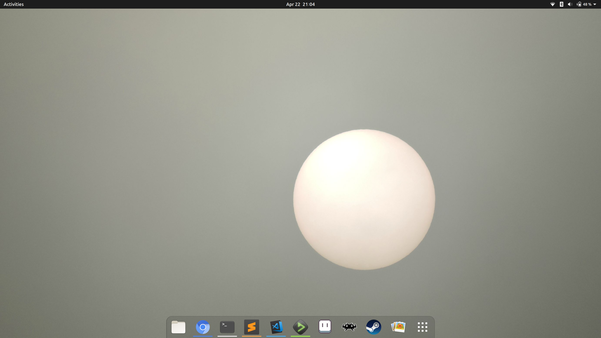

# Dotfiles
My Ubuntu system configuration



## Back Up
1. Empty trash; consider dumping Steam and Wine games
1. Copy files: `cd / && tarpipe /media/stephen/disk/home home`
1. Backup with rsnapshot too: `backup alpha`
1. Back up browser tabs, unsaved editor files (check Sublime Text and deadbeef)
1. Back up packages and verify contents (see rsnapshot config)
1. Download the latest Ubuntu release and check `md5sum`
1. Copy to USB thumbdrive (not SD Card): `mkfs.fat -I -n FOO /dev/sdX && time dd bs=4M if=foo.iso of=/dev/sdX`
1. Take screenshot of launcher

## Restore

### Miscellaneous
- Decompress backup: `time tar xf /media/stephen/disk/home-2016-01-01-00-00-00-000000000.tar.gz -I pigz`
- Enable all proprietary drivers
- Link system dotfiles
- Update launcher to screenshot

### Packages

#### APT
```bash
sudo add-apt-repository ppa:graphics-drivers/ppa &&
sudo add-apt-repository ppa:webupd8team/atom &&
sudo add-apt-repository ppa:wine/wine-builds &&
sudo apt update &&

sudo apt dist-upgrade &&
sudo apt upgrade &&

sudo apt install atom autojump chromium-browser clang cmake compizconfig-settings-manager dos2unix feh fontforge fontforge-extras fonts-roboto gimp git-gui gitk gnome-specimen gparted htop imagemagick inkscape jq libgnome-keyring-dev libimage-exiftool-perl llvm meld mplayer nmap nvidia-settings pigz puredata pv qemu rsnapshot sg3-utils sox unity-tweak-tool vim vim-gnome vlc wmctrl xclip xdotool xvfb &&

sudo apt install dolphin-emu mess retroarch winehq-staging
```

#### Manual Downloads
- [Blender](https://www.blender.org/download/)
- [Chrome](https://www.google.com/chrome/browser/desktop/)
- [deadbeef](https://sourceforge.net/projects/deadbeef/files/travis/linux/master/)
- [itch](https://itch.io/app)
- [Node.js](https://nodejs.org/en/)
- [Postman](https://www.getpostman.com/apps)
- [ripgrep](https://github.com/BurntSushi/ripgrep/releases)
- [Steam](http://store.steampowered.com/about/)
- [Sublime Text](https://www.sublimetext.com/3)
- [Vagrant](https://www.vagrantup.com/downloads.html)
- [VirtualBox + extensions](https://www.virtualbox.org/wiki/Downloads)
- [Visual Studio Code](https://code.visualstudio.com/download)

#### Compare Packages
```bash
alias strip='sed -r "1,5 d; s%^(ii|rc)\s+([^ ]+).*%\2%"' &&
meld <(strip dpkg.txt|sort) <(dpkg -l|strip|sort)
# other comparisons are manual
```

### Appearance
```bash
# disable input source indicator
gsettings get com.canonical.indicator.keyboard visible &&
gsettings set com.canonical.indicator.keyboard visible false

# don't autohide the menu bar
gsettings get com.canonical.Unity always-show-menus &&
gsettings set com.canonical.Unity always-show-menus true

# show the menu bar in the window not in the top panel
gsettings get com.canonical.Unity integrated-menus &&
gsettings set com.canonical.Unity integrated-menus true

# autohide the launcher
gsettings get org.compiz.unityshell:/org/compiz/profiles/unity/plugins/unityshell/ launcher-hide-mode &&
gsettings set org.compiz.unityshell:/org/compiz/profiles/unity/plugins/unityshell/ launcher-hide-mode 1

# move the launcher to the bottom
gsettings get com.canonical.Unity.Launcher launcher-position &&
gsettings set com.canonical.Unity.Launcher launcher-position Bottom

# background
gsettings get org.gnome.desktop.background picture-uri &&
gsettings set org.gnome.desktop.background picture-uri file:///home/stephen/.bg

# change theme to Radiance:
gsettings get org.gnome.desktop.wm.preferences theme &&
gsettings get org.gnome.desktop.interface gtk-theme &&
gsettings set org.gnome.desktop.wm.preferences theme Radiance &&
gsettings set org.gnome.desktop.interface gtk-theme Radiance
gsettings get org.gnome.desktop.interface icon-theme &&
gsettings set org.gnome.desktop.interface icon-theme ubuntu-mono-light

# enable ui scaling
gsettings get org.gnome.desktop.interface text-scaling-factor &&
gsettings set org.gnome.desktop.interface text-scaling-factor 1.75

# enable lo graphics mode
gsettings get org.compiz.unityshell:/org/compiz/profiles/unity/plugins/unityshell/ low-graphics-mode &&
gsettings set org.compiz.unityshell:/org/compiz/profiles/unity/plugins/unityshell/ low-graphics-mode true
```

### Keybindings
```bash
# screenshot
gsettings get org.compiz.integrated command-1 &&
gsettings set org.compiz.integrated command-1 'snap'
gsettings get org.compiz.integrated run-command-1 &&
gsettings set org.compiz.integrated run-command-1 "['<Control><Alt>p']"

# alt is not a system key, super is
# command dialog
gsettings get org.compiz.integrated show-hud &&
gsettings set org.compiz.integrated show-hud "['<Alt><Super>']"
# mouse
gsettings get org.gnome.desktop.wm.preferences mouse-button-modifier &&
gsettings set org.gnome.desktop.wm.preferences mouse-button-modifier '<Super>'

# long pressing super should show launcher not hint overlay
gsettings get org.compiz.unityshell:/org/compiz/profiles/unity/plugins/unityshell/ shortcut-overlay &&
gsettings set org.compiz.unityshell:/org/compiz/profiles/unity/plugins/unityshell/ shortcut-overlay false

# disable tap to click
gsettings get org.gnome.desktop.peripherals.touchpad tap-to-click &&
gsettings set org.gnome.desktop.peripherals.touchpad tap-to-click false

# super-d toggles shows desktop
gsettings get org.compiz.unityshell:/org/compiz/profiles/unity/plugins/unityshell/ show-desktop-key &&
gsettings set org.compiz.unityshell:/org/compiz/profiles/unity/plugins/unityshell/ show-desktop-key '<Super>d'
```

### Terminal
Set scrollback to unlimited

### Chromium
#### about://settings
- Sign in
- Check On startup -> Continue where you left off
- Uncheck Appearance -> Use system title bar and borders
- Make Chromium the default

#### chrome://extensions
- [uBlock](https://chrome.google.com/webstore/detail/ublock/cjpalhdlnbpafiamejdnhcphjbkeiagm)

### Git
```bash
sudo apt install libgnome-keyring-dev &&
cd /usr/share/doc/git/contrib/credential/gnome-keyring &&
sudo make
```