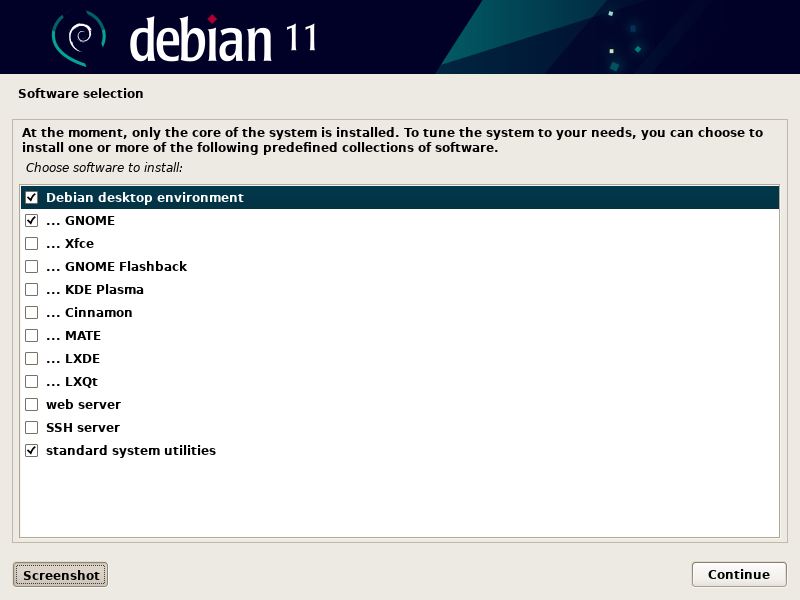

# .files

My system configuration.

## Hardware

### Laptop

Essentially, a ThinkPad X1 Yoga Gen 6 with maxed out specs, part number
20XYCTO1WW:

- 11th Generation Intel® Core™ i7-1185G7 Processor with vPro™ (3.00 GHz, up to
  4.80 GHz with Turbo Boost, 4 Cores, 8 Threads, 12 MB Cache)
- Linux Ubuntu 20.04
- Linux Ubuntu World Wide Multiple Language
- 32 GB LPDDR4x 4266MHz (Soldered)
- 256 GB PCIe SSD, OPAL
- 14.0" UHD+ (3840 x 2400) IPS, anti-reflective, anti-smudge, touchscreen, 500
  nits
- Integrated Intel® Iris® Xe Graphics
- Grey
- IR & 720p HD
- Lenovo Integrated Pen
- Intel® Wi-Fi 6 AX201 802.11AX with vPro™ (2 x 2) & Bluetooth® 5.2
- Fingerprint Reader
- Backlit - US English
- Enabled Discrete TPM2.0
- BIOS Absolute Enabled
- 4 Cell Li-Polymer 57Wh
- 65W AC
- 14.0" WQUXGA (3840x2400) IPS Anti Reflection/Anti Smudge 500nit MultiTouch
  Narrow Bezel 100% DCI-P3 HDR, IR and HD Camera, Mic
- Retail Packaging
- Publication-English
- 1 Year Depot or Carry-in

With the following service plans:
- 3Y Courier/Carry-in upgrade from 1Y Courier/Carry-in, part number 5WS0E97328
- 3Y Accidental Damage Protection Add On, part number 5PS0F15928

I wished to try a WWAN, as my partner's carrier, Google Fi, provides data SIMs
at no additional charge, but
[PSREF lists them as unavailable in the US](https://psref.lenovo.com/Product/ThinkPad/ThinkPad_X1_Yoga_Gen_6). I've read one cannot be retroactively added due to a
missing antenna assembly.

I ordered the cheapest hard drive available and replaced it with a
"[Samsung 2TB 980 PRO PCIe 4.0 x4 M.2 Internal SSD](https://www.bhphotovideo.com/c/product/1624326-REG/samsung_mz_v8p2t0b_am_2tb_980_pro_pcie.html)"
according to this
[replacement guide](https://www.youtube.com/watch?v=j6zhenaLjho).

The builtin webcam is poor. The keyboard is lovely.

There seemed to be able to be a perpetual sale of some sort and I was also able
to use a partner discount.

### External GPU

- [AMD Radeon RX 6900 XT Graphics processing unit](https://www.amd.com/en/direct-buy/5458372200/us)
- [Razer Core X Chroma enclosure](https://www.razer.com/gaming-egpus/razer-core-x/RC21-01430100-R3U1)
- [Noctua NF-A12x25 5V 120 mm fan](https://noctua.at/en/products/fan/nf-a12x25-5v)
- [Corsair SF750 80 Plus Platinum SFX Power Supply unit](https://www.corsair.com/us/en/Categories/Products/Power-Supply-Units/Power-Supply-Units-Advanced/SF-Series/p/CP-9020186-NA)
- [100 mm² x 1 mm thermal pad](https://www.amazon.com/dp/B086W119DK)

I used the [egpu.io buyer's guide and forum](https://egpu.io) to inform.

The GPU fans don't ever see to run at a very fast rate but when they were above a low speed, they're noisy.

The original power supply's fan is always on. The replacement's doesn't turn on until the load exceeds 300 W. I would replace the fan in it but I don't think I've ever heard it turn on and I don't want to risk working near large capacitors. The replacement supply is so much smaller than the original and is unable to mount to anything so it rests on the thermal pad which I divided in half and stacked to align the plug with the opening. I don't think a thermal pad is necessary over a piece of appropriately sized metal but it's tacky which helps keep the unit in place.

I had replaced the side fan with a 12 V [Noctua NF-S12B redux-700](https://noctua.at/en/nf-s12b-redux-700) as I read that the enclosure's voltage was inconsistent but 5 V or above, it's [the quietest 120 mm fan available](https://www.quietpc.com/120mmfans), and I figured the worst case scenario would be that the GPU fans would kick on or the system would go into thermal shutdown. It worked and it was almost silent but I think the system was too hot. It was almost always quite warm and, when in heavy use, downright hot. I replaced the fan with the quietest 5 V fan available but it is significantly louder. The system is always quite cool now. Maybe a 140 mm would fit. I wish the enclosure had a 12 V PWM (four pin).

The GPU fans blow outward so I had flipped the direction of the side fan to blow inward but the GPU doesn't quite cover the air vent so I guessed that the original design to have both the side fan and GPU fans blowing outwards is probably best and have stuck with that. [The airflow direction of the side fan is from the manufacturer's label outwards](https://noctua.at/en/how-can-i-find-out-the-direction-of-airflow-and-sense-of-rotation). I imagine that the air could mostly flow in over the power supply where there's a small vent but the case is really just an approximation for any card that fits and having replaced the supply with such a different one, I suppose all bets are off.

### Peripherals

- [Dell UltraSharp 27 4K USB-C Monitor - U2720Q, 68.4cm (27") (210-AVJV)](https://www.dell.com/en-us/work/shop/ultrasharp-27-4k-usb-c-monitor-u2720q/apd/210-avjv/monitors-monitor-accessories)
- [CalDigit TS3 Plus](https://www.caldigit.com/ts3-plus)
- [8BitDo SN30 Pro+](https://www.8bitdo.com/sn30-pro-plus)
- [CalDigit Thunderbolt 3 Cables](http://shop.caldigit.com/us/TBT3-A20B-540) x2
- [MX Vertical Advanced Ergonomic Mouse](https://www.logitech.com/en-us/products/mice/mx-vertical-ergonomic-mouse.910-005447.html)
- Apple Wired Keyboard (A1243)

## Back Up
1. Empty trash; consider dumping Steam and Wine games.
2. Export bookmarks and settings from Firefox and bookmarklets from Chromium.
3. Back up browser tabs, unsaved editor files (check Code, Sublime Text, and
   DeaDBeeF).
4. Back up packages and verify contents.
5. Check Grub options.
6. Take screenshot of launcher.
7. Copy files: `cd / && tarpipe /media/stephen/disk/home home`.
8. Backup with rsync too: `backup`. To-do: checksum tally as I go.
9. Download the latest [Debian stable release](https://cdimage.debian.org/images/unofficial/non-free/images-including-firmware/11.0.0+nonfree/amd64/iso-dvd/) and check `md5sum *.iso`.
10. Copy to USB thumbdrive (not SD Card): `mkfs.fat -I -n FOO /dev/sdX && time dd bs=4M if=foo.iso of=/dev/sdX`.

## Install

### BIOS

Set the sleep state to "Windows and Linux" for now. S3 seems to cause the
trackpad to stutter after sleep. I don't remember what else I changed but it was
a number of things, including, I think, enabling secure boot.

### Debian Installer

I wanted to increase the swap partition size but it didn't seem customizable in
itself. I haven't notice any out-of-memory issues.




### Grub

Edit /etc/default/grub with the following
[temporary changes for keyboard lag](https://forums.lenovo.com/t5/ThinkPad-X-Series-Laptops/Lag-and-stuttering-on-X1-Carbon-Gen-9-while-running-Linux-untested-on-Windows/m-p/5082352):

```grub
GRUB_CMDLINE_LINUX_DEFAULT="i915.enable_psr=0"
```

### Firmware

The following grabbed the latest upgrades listed on the manufacturer's website:

```bash
fwupdmgr refresh
fwupdmgr get-devices
sudo fwupdmgr update
```

I had trouble getting fwupd to recognize my 8BitDo SF30 Pro controller and I'm unsure
if changing the controller's boot mode (maybe L1 + R1 + Start) or using a custom
fwupdmgr install fixed it. I used [macOS for the SN30 Pro+](https://support.8bitdo.com/firmware-updater.html) ([see issue](https://github.com/fwupd/fwupd/issues/1681)).

### External GPU

With the AMD graphic drives loaded (amdgpu), radeontop has very low usage during normal desktop usage and high usage playing games:

```bash
sudo radeontop
```

Without the AMD driver, usage was high for desktop.

```lines=16
 * Razer Core X Chroma
   |- type:          peripheral
   |- name:          Core X Chroma
   |- vendor:        Razer
   |- uuid:          ••••••••-••••-••••-••••-••••••••••••
   |- generation:    Thunderbolt 3
   |- status:        authorized
   |  |- domain:     ••••••••-••••-••••-••••-••••••••••••
   |  |- rx speed:   40 Gb/s = 2 lanes * 20 Gb/s
   |  |- tx speed:   40 Gb/s = 2 lanes * 20 Gb/s
   |  `- authflags:  none
   |- authorized:    Sat 02 Oct 2021 11:33:22 PM UTC
   |- connected:     Sat 02 Oct 2021 11:33:22 PM UTC
   `- stored:        Sun 26 Sep 2021 10:52:12 PM UTC
      |- policy:     iommu
      `- key:        no

 * Razer Core X Chroma #2
   |- type:          peripheral
   |- name:          Core X Chroma
   |- vendor:        Razer
   |- uuid:          ••••••••-••••-••••-••••-••••••••••••
   |- generation:    Thunderbolt 3
   |- status:        authorized
   |  |- domain:     ••••••••-••••-••••-••••-••••••••••••
   |  |- rx speed:   40 Gb/s = 2 lanes * 20 Gb/s
   |  |- tx speed:   40 Gb/s = 2 lanes * 20 Gb/s
   |  `- authflags:  none
   |- authorized:    Sat 02 Oct 2021 11:33:29 PM UTC
   |- connected:     Sat 02 Oct 2021 11:33:29 PM UTC
   `- stored:        Sun 26 Sep 2021 10:52:13 PM UTC
      |- policy:     iommu
      `- key:        no

 * CalDigit, Inc. TS3 Plus
   |- type:          peripheral
   |- name:          TS3 Plus
   |- vendor:        CalDigit, Inc.
   |- uuid:          ••••••••-••••-••••-••••-••••••••••••
   |- generation:    Thunderbolt 3
   |- status:        authorized
   |  |- domain:     ••••••••-••••-••••-••••-••••••••••••
   |  |- rx speed:   20 Gb/s = 2 lanes * 10 Gb/s
   |  |- tx speed:   20 Gb/s = 2 lanes * 10 Gb/s
   |  `- authflags:  none
   |- authorized:    Sat 02 Oct 2021 11:33:23 PM UTC
   |- connected:     Sat 02 Oct 2021 11:33:23 PM UTC
   `- stored:        Sun 26 Sep 2021 10:52:12 PM UTC
      |- policy:     iommu
      `- key:        no
```

to-do: revise the readout with the new cable.

Install the AMD driver with `sudo modprobe -v amdgpu` which will either quit the current session or hang it. In the latter case, reset it with `alt-prtsc-k`. I think this requires booting with the cable in.

`lspci -k | grep -EiA3 '3d|vga|video'` reports the drivers used:

```
lspci -k | grep -EA3 '3D|VGA|Video'
00:02.0 VGA compatible controller: Intel Corporation TigerLake-LP GT2 [Iris Xe Graphics] (rev 01)
  Subsystem: Lenovo Iris Xe Graphics
  Kernel driver in use: i915
  Kernel modules: i915
--
24:00.0 VGA compatible controller: Advanced Micro Devices, Inc. [AMD/ATI] Navi 21 [Radeon RX 6800/6800 XT / 6900 XT] (rev c0)
  Subsystem: Advanced Micro Devices, Inc. [AMD/ATI] Gigabyte AMD Radeon RX 6900 XT
  Kernel driver in use: amdgpu
  Kernel modules: amdgpu
```

System information as detected by Steam:

```
…
Video Card:
    Driver:  AMD AMD Radeon RX 6900 XT (SIENNA_CICHLID, DRM 3.42.0, 5.14.0-1-amd64, LLVM 12.0.1)
    Driver Version:  4.6 (Compatibility Profile) Mesa 21.2.0-devel
    OpenGL Version: 4.6
    Desktop Color Depth: 24 bits per pixel
    Monitor Refresh Rate: 59 Hz
    VendorID:  0x1002
    DeviceID:  0x73bf
    Revision Not Detected
    Number of Monitors:  1
    Number of Logical Video Cards:  2
    Primary Display Resolution:  3840 x 2160
    Desktop Resolution: 3840 x 2160
    Primary Display Size: 23.62" x 13.39" (27.13" diag)
                                            60.0cm x 34.0cm (68.9cm diag)
    Primary VRAM: 16384 MB
…
```

`glxgears` should report ~60 FPS at any size. The open-source driver seems to flip between the integrated GPU for windowing and external GPU for 3D. The amdgpu driver uses external for everything, I think.

`glxinfo -B` reports:

```
name of display: :0
display: :0  screen: 0
direct rendering: Yes
Extended renderer info (GLX_MESA_query_renderer):
    Vendor: AMD (0x1002)
    Device: AMD Radeon RX 6900 XT (SIENNA_CICHLID, DRM 3.42.0, 5.14.0-1-amd64, LLVM 12.0.1) (0x73bf)
    Version: 21.2.0
    Accelerated: yes
    Video memory: 16384MB
    Unified memory: no
    Preferred profile: core (0x1)
    Max core profile version: 4.6
    Max compat profile version: 4.6
    Max GLES1 profile version: 1.1
    Max GLES[23] profile version: 3.2
Memory info (GL_ATI_meminfo):
    VBO free memory - total: 15027 MB, largest block: 15027 MB
    VBO free aux. memory - total: 15723 MB, largest block: 15723 MB
    Texture free memory - total: 15027 MB, largest block: 15027 MB
    Texture free aux. memory - total: 15723 MB, largest block: 15723 MB
    Renderbuffer free memory - total: 15027 MB, largest block: 15027 MB
    Renderbuffer free aux. memory - total: 15723 MB, largest block: 15723 MB
Memory info (GL_NVX_gpu_memory_info):
    Dedicated video memory: 16384 MB
    Total available memory: 32752 MB
    Currently available dedicated video memory: 15027 MB
OpenGL vendor string: AMD
OpenGL renderer string: AMD Radeon RX 6900 XT (SIENNA_CICHLID, DRM 3.42.0, 5.14.0-1-amd64, LLVM 12.0.1)
OpenGL core profile version string: 4.6 (Core Profile) Mesa 21.2.0-devel
OpenGL core profile shading language version string: 4.60
OpenGL core profile context flags: (none)
OpenGL core profile profile mask: core profile

OpenGL version string: 4.6 (Compatibility Profile) Mesa 21.2.0-devel
OpenGL shading language version string: 4.60
OpenGL context flags: (none)
OpenGL profile mask: compatibility profile

OpenGL ES profile version string: OpenGL ES 3.2 Mesa 21.2.0-devel
OpenGL ES profile shading language version string: OpenGL ES GLSL ES 3.20
```

When using the stock open-source drivers, mine always showed the integrated GPU except when I explicitly used `DRI_PRIME=1 glxgears`. However, even when enabled, frame rates were terrible with the open-source drivers. I think game frame rates were ok but there was a ton of input lag on the mouse and keyboard. amdgpu doesn't perform very well either when forced:

```
$ DRI_PRIME=1 glxgears
libGL error: MESA-LOADER: failed to open iris: /opt/amdgpu/lib/x86_64-linux-gnu/dri/iris_dri.so: cannot open shared object file: No such file or directory (search paths /opt/amdgpu/lib/x86_64-linux-gnu/dri)
libGL error: failed to load driver: iris
19883 frames in 5.0 seconds = 3969.349 FPS
419 frames in 5.0 seconds = 83.784 FPS
420 frames in 5.0 seconds = 83.799 FPS
```

Without `DRI_PRIME`, it's fine:

```
$ glxgears
Running synchronized to the vertical refresh.  The framerate should be
approximately the same as the monitor refresh rate.
303 frames in 5.0 seconds = 60.570 FPS
300 frames in 5.0 seconds = 59.995 FPS
```

And:

```
vblank_mode=0 glxgears
ATTENTION: default value of option vblank_mode overridden by environment.
107644 frames in 5.0 seconds = 21528.650 FPS
88601 frames in 5.0 seconds = 17719.971 FPS
68304 frames in 5.0 seconds = 13660.693 FPS
68198 frames in 5.0 seconds = 13639.584 FPS
```

What doesn't work so far:
- Internal GPU performance suffers noticeably when the external GPU is detached. Window manager animations just jump and the unit is noticeably less efficient.
- Hotplugging and module loading. I have to power off, at/detach the cable, and `modprobe amdgpu`.
- Display sleeping for more than a minute. I use a script, `display-sleep`, power off the monitor, then run the script again on my laptop.
- After `amdgpu-install`, `apt` is broken. The system seems to work more or less but the installation is broken.

Observations:

- Max Payne 3 runs smoothly on nearly maxed out settings. Unfortunately, the internal GPU's memory is incorrectly identified as the limit and the game forbids exceeding it.
- Red Dead Redemption 2: still experimenting. I seem to get about 30 FPS with maxed or minimized settings but perhaps they're not taking.
- Portal runs smoothly on maxed out settings.
- Chrome's FPS meter is broken but Nature Elsewhere runs smoothly.
- NES runs smoothly.

### Groups

The input group is need for joystick access.

```bash
su -c '/sbin/usermod -aG sudo stephen' && echo ok
su -c '/sbin/usermod -aG input stephen' && echo ok
```

This required a reboot not just a logout.

### Inputs

X-Box mode (2 LEDs) works well. I calibrated and remapped axes with `jstest-gtk` then persisted the state with `sudo jscal-store /dev/input/js1`.

### Restore

1. Disable suspend on AC:
  ```bash
  gsettings get org.gnome.settings-daemon.plugins.power sleep-inactive-ac-type &&
  gsettings set org.gnome.settings-daemon.plugins.power sleep-inactive-ac-type nothing
  ```
2. `sudo apt install pigz vim`.
3. Decompress backup: `time tar xf /media/stephen/disk/home-2016-01-01-00-00-00-000000000.tar.gz -I pigz && echo ok`.

### APT

1. Open Software & Updates.
2. View Other Software.
3. Disable cdrom as a software source.

```bash
sudo apt update &&
sudo apt upgrade &&
sudo apt dist-upgrade &&
sudo apt install \
  blender build-essential calibre chromium code colordiff \
  command-not-found csvtool curl diffpdf entr fd-find flac flameshot fontforge \
  fonts-roboto fzf gimp git gpick gthumb htop imagemagick inkscape jstest-gtk \
  libimage-exiftool-perl lm-sensors lshw meld mednafen mesa-utils moreutils mpv nmap \
  nodejs npm obs-studio opus-tools peek picard pigz potrace powertop pv \
  radeontop rsync scrcpy sg3-utils sox tmux tree ttf-bitstream-vera \
  vim whois wmctrl xclip xdotool zoxide &&
sudo apt remove evolution rhythmbox &&
sudo apt autoremove
```

#### Compare Previously Installed Packages
```bash
alias strip='sed -r "1,5 d; s%^(ii|rc)\s+([^ ]+).*%\2%"' &&
meld <(strip dpkg.txt|sort) <(dpkg -l|strip|sort)
```

### NPM

```bash
npm i -g create-react-app live-server npm-check-updates source-map-explorer
```

### Wine

```bash
sudo apt install wine winetricks &&
sudo dpkg --add-architecture i386 &&
sudo apt update && sudo apt install wine32
```

#### Exact Audio Copy

```bash
# Select the default prefix and install just dotnet20 without the service packs.
WINEARCH=win32 WINEPREFIX="$HOME/opt/eac" winetricks
WINEARCH=win32 WINEPREFIX="$HOME/opt/eac" wine ~/dl/eac-1.6.exe
```

The program settings are not easily isolated. They're smattered across the
Windows registry and elsewhere, unfortunately. Additionally, some are CD drive
specific.

### Chromium

1. Set chrome://flags/#force-color-profile to sRGB.
2. Disable cache in the DevTools network tab.

##### about://settings

- Check On startup -> Continue where you left off.
- Make Chromium the default.
- Change search to DuckDuckGo.
- Enable classic theme otherwise incognito mode isn't different enough.

#### chrome://extensions

- [uBlock](https://chrome.google.com/webstore/detail/ublock/cjpalhdlnbpafiamejdnhcphjbkeiagm)
- [React](https://chrome.google.com/webstore/detail/react-developer-tools/fmkadmapgofadopljbjfkapdkoienihi)
- [Redux](https://chrome.google.com/webstore/detail/redux-devtools/lmhkpmbekcpmknklioeibfkpmmfibljd)

### Firefox

I use Firefox as a bookmark manager presently. Debian stable is ancient so I had
to export my bookmarks as JSON and reimport them on the old version.

### Sublime Text

```bash
curl https://download.sublimetext.com/sublimehq-pub.gpg |
sudo apt-key add -
echo 'deb https://download.sublimetext.com/ apt/stable/' |
sudo tee /etc/apt/sources.list.d/sublime-text.list
sudo apt update &&
sudo apt install sublime-text
# Register.
```

### Manual Downloads

- [Aseprite](https://www.aseprite.org)
- [bat](https://github.com/sharkdp/bat/releases)
- [Chrome](https://www.google.com/chrome)
- [DeaDBeeF](http://deadbeef.sourceforge.net/download.html)
- [Delta](https://github.com/dandavison/delta/releases)
- [Disk Usage/Free Utility](https://github.com/muesli/duf)
- [entr](https://github.com/eradman/entr/releases)
- [Foliate](https://github.com/johnfactotum/foliate/releases)
- [Radeon Driver](https://www.amd.com/en/support/graphics/amd-radeon-6000-series/amd-radeon-6900-series/amd-radeon-rx-6900-xt) (amdgpu-install, pro-install hangs system on reboot)
- [ripgrep](https://github.com/BurntSushi/ripgrep/releases)
- [Steam](https://store.steampowered.com/about/)
- [Visual Studio Code](https://code.visualstudio.com/download)

### GNOME Extensions

Install via Firefox:

- [Emoji Selector](https://extensions.gnome.org/extension/1162/emoji-selector/)

### UI

```bash
# Show battery percentage.
gsettings get org.gnome.desktop.interface show-battery-percentage &&
gsettings set org.gnome.desktop.interface show-battery-percentage true

# Disable bell.
gsettings get org.gnome.desktop.wm.preferences audible-bell &&
gsettings set org.gnome.desktop.wm.preferences audible-bell false

# Allow file trees to be show inline.
gsettings get org.gnome.nautilus.list-view use-tree-view &&
gsettings set org.gnome.nautilus.list-view use-tree-view true

# Set the default file zoom to tiny.
gsettings get org.gnome.nautilus.list-view default-zoom-level &&
gsettings set org.gnome.nautilus.list-view default-zoom-level small

# Set the file columns.
# [to-do] Add crtime: https://gitlab.gnome.org/GNOME/nautilus/-/issues/1566.
gsettings get org.gnome.nautilus.list-view default-visible-columns &&
gsettings set org.gnome.nautilus.list-view default-visible-columns "['name', 'size', 'type', 'mime_type', 'date_modified_with_time', 'date_accessed']"

# Always show the file location bar instead of the descendent GUI.
gsettings get org.gnome.nautilus.preferences always-use-location-entry &&
gsettings set org.gnome.nautilus.preferences always-use-location-entry true

# Show hidden files.
gsettings get org.gnome.nautilus.preferences show-hidden-files &&
gsettings set org.gnome.nautilus.preferences show-hidden-files true

# Pin favorite programs to the dock.
gsettings get org.gnome.shell favorite-apps &&
gsettings set org.gnome.shell favorite-apps "['org.gnome.Nautilus.desktop', 'sublime_text.desktop', 'chromium.desktop', 'code.desktop', 'deadbeef.desktop', 'org.gnome.Terminal.desktop', 'aseprite.desktop', 'org.gnome.gThumb.desktop', 'com.github.johnfactotum.Foliate.desktop', 'gnome-system-monitor.desktop', 'mednaffe.desktop', 'steam.desktop']"
```

### Keybindings

```bash
# Press fnc + esc to invert the function keys.

# Flip command and alt keys on Apple keyboards.
echo options hid_apple fnmode=2 swap_opt_cmd=1 |
sudo tee -a /etc/modprobe.d/hid_apple.conf
sudo update-initramfs -u

# Disable middle click to paste.
gsettings get org.gnome.desktop.interface gtk-enable-primary-paste &&
gsettings set org.gnome.desktop.interface gtk-enable-primary-paste false

# Screenshot is ctrl-super-p / ctrl-super-alt-p.
gsettings get org.gnome.settings-daemon.plugins.media-keys screenshot &&
gsettings set org.gnome.settings-daemon.plugins.media-keys screenshot "['<Ctrl><Super>P']"
gsettings get org.gnome.settings-daemon.plugins.media-keys window-screenshot &&
gsettings set org.gnome.settings-daemon.plugins.media-keys window-screenshot "['<Ctrl><Alt><Super>P']"

# Enable tap-to-click. The trackpad is too stiff.
gsettings get org.gnome.desktop.peripherals.touchpad tap-to-click && gsettings set org.gnome.desktop.peripherals.touchpad tap-to-click true

# Set super-T to open terminal.
```

### Meld

```bash
gsettings get org.gnome.meld indent-width &&
gsettings set org.gnome.meld indent-width 2

gsettings get org.gnome.meld highlight-syntax &&
gsettings set org.gnome.meld highlight-syntax true
```

### MakeMKV

1. Download the latest: https://www.makemkv.com/forum/viewtopic.php?f=3&t=224.
2. Install dependencies:
```
sudo apt install libbluray-dev libbluray2 libbluray-bdj libaacs0 libaacs-dev libbdplus0 libbdplus-dev
```
3. Follow the forum directions (I couldn't get a prefix install to work).
4. Register.

### Powertop

To-do: How can I run configure mode non-interactively until it has enough
samples?

```bash
sudo powertop -c
sudo powertop --auto-tune
```

### lm_sensors

Attempt most and automatically to modules:

```bash
sudo sensors-detect &&
sensors -u
```

AMDGPU SMU (i2c-12) caused a segfault in sensors-detect so I skipped it.

### Terminal

```bash
# Clone the default profile as "Default".

profile=$(gsettings get org.gnome.Terminal.ProfilesList default)
profile=${profile:1:-1}

# Do not limit scrollback.
gsettings get org.gnome.Terminal.Legacy.Profile:/org/gnome/terminal/legacy/profiles:/:$profile/ scrollback-unlimited &&
gsettings set org.gnome.Terminal.Legacy.Profile:/org/gnome/terminal/legacy/profiles:/:$profile/ scrollback-unlimited true

# Disable bell.
gsettings get org.gnome.Terminal.Legacy.Profile:/org/gnome/terminal/legacy/profiles:/:$profile/ audible-bell &&
gsettings set org.gnome.Terminal.Legacy.Profile:/org/gnome/terminal/legacy/profiles:/:$profile/ audible-bell false

# Set default size to 100x40.
gsettings get org.gnome.Terminal.Legacy.Profile:/org/gnome/terminal/legacy/profiles:/:$profile/ default-size-columns &&
gsettings set org.gnome.Terminal.Legacy.Profile:/org/gnome/terminal/legacy/profiles:/:$profile/ default-size-columns 100
gsettings get org.gnome.Terminal.Legacy.Profile:/org/gnome/terminal/legacy/profiles:/:$profile/ default-size-rows &&
gsettings set org.gnome.Terminal.Legacy.Profile:/org/gnome/terminal/legacy/profiles:/:$profile/ default-size-rows 40
```

### Image Viewer (eog)

```bash
# Keep it pixelated.
gsettings get org.gnome.eog.view extrapolate &&
gsettings set org.gnome.eog.view extrapolate false
gsettings get org.gnome.eog.view interpolate &&
gsettings set org.gnome.eog.view interpolate false
```

### DeaDBeeF

- Enable GTK3 theme.
- Enable file browser plugin.

### Picard

### Calibre / Kindle

### Miscellaneous

- Add user icon.

```bash
# Enable location services.
gsettings get org.gnome.system.location enabled &&
gsettings set org.gnome.system.location enabled true

# Set lock screen delay to 10 min.
gsettings get org.gnome.desktop.session idle-delay &&
gsettings set org.gnome.desktop.session idle-delay 600

# Allow Bluetooth sleeping.
```

## License (GPLv3)

© Stephen Niedzielski.

### GPL-3.0-only

This program is free software: you can redistribute it and/or modify it under
the terms of the GNU General Public License as published by the Free Software
Foundation, version 3.

This program is distributed in the hope that it will be useful, but WITHOUT ANY
WARRANTY; without even the implied warranty of MERCHANTABILITY or FITNESS FOR A
PARTICULAR PURPOSE. See the GNU General Public License for more details.

You should have received a copy of the GNU General Public License along with
this program. If not, see <https://www.gnu.org/licenses/>.
